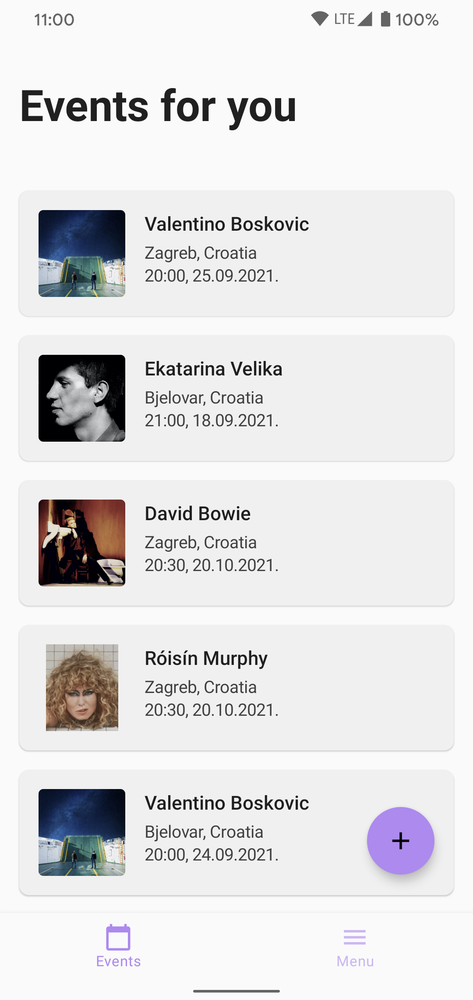
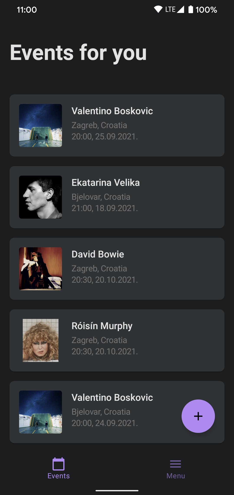
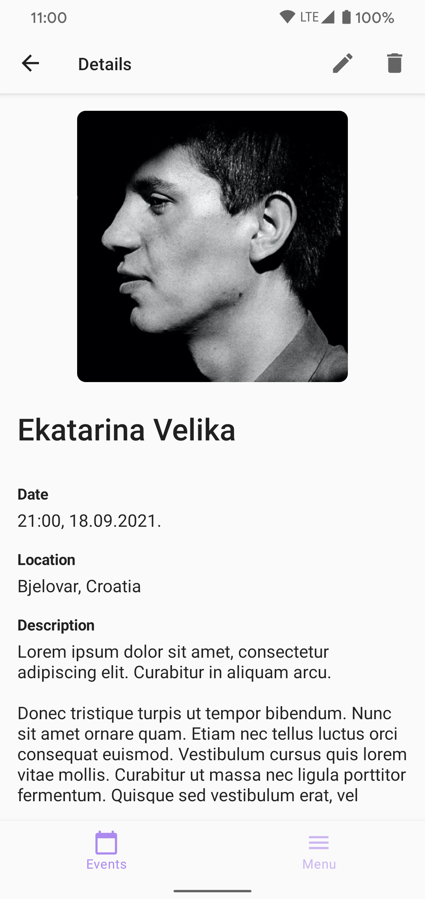
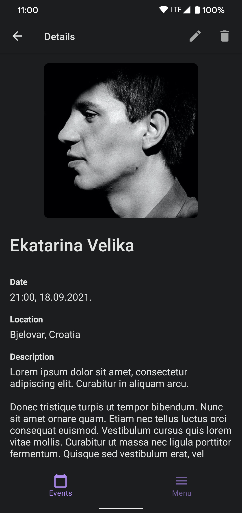
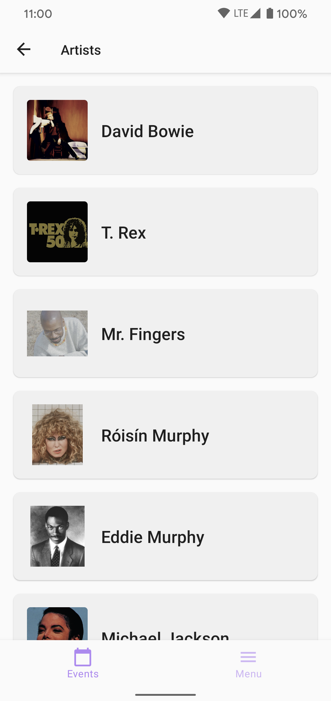
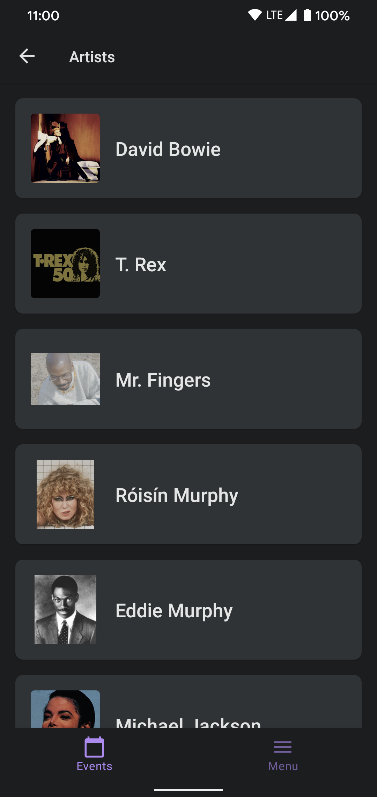

## Music Event Manager

Compose app with dummy data which serves as a playground to try out new things in the Android world.

### Description

The app primarily serves as a showcase of Compose UI and how to implement a new app with Compose UI.

The implementation consists of a single activity with different composables which are orchestrated with the navigation compose library.

The app has a database with two entities which are in a relationship. There are some input fields for adding new data to the database, but there is no validation on that data.

It is possible to change the app theme in the settings screen. The app can also follow the system theme, if that setting is selected.

### Tech stack
- Kotlin
- Kotlin Coroutines & Flows
- Compose UI for Android
- Dagger Hilt - dependency injection
- Coil - image loading
- Room - database for the dummy data
- DataStore - user preferences storage
- ...

### Screenshots

  
  

  
  

  
  

